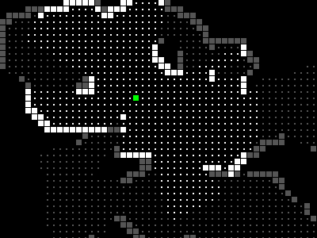

# fov.js
### field of vision calculation library

fov.js calculates fields of view on low resolution rasters, suitable for
roguelike games.



fov.js is based on the C library [libfov](http://code.google.com/p/libfov).

## Example

```javascript
var fov_settings = {
	opaque: function (map, x, y) { return isOpaque(map.at(x,y)) },
	apply: function (map, x, y) { return map.at(x,y).visible = true },
	opaque_apply: true
}
fov.circle(fov_settings, map, game.player.x, game.player.y, 30)
```

The `opaque` function specified in the settings object will be called to
determine whether the tile at (x,y) is opaque. The `apply` function will be
called at each tile that is determined to be visible. If `opaque_apply` is
false (the default), `apply` will not be called on any visible tiles that are
opaque.
